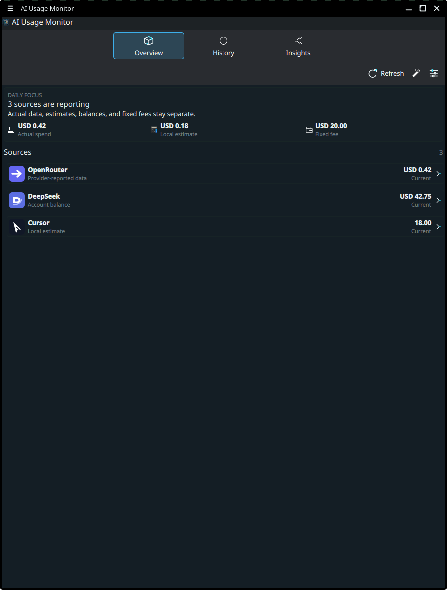
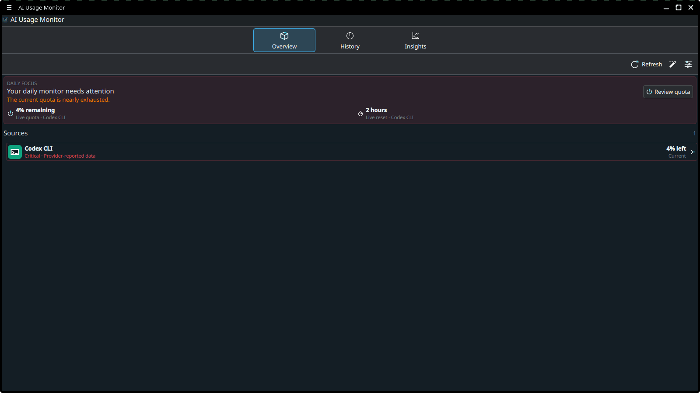
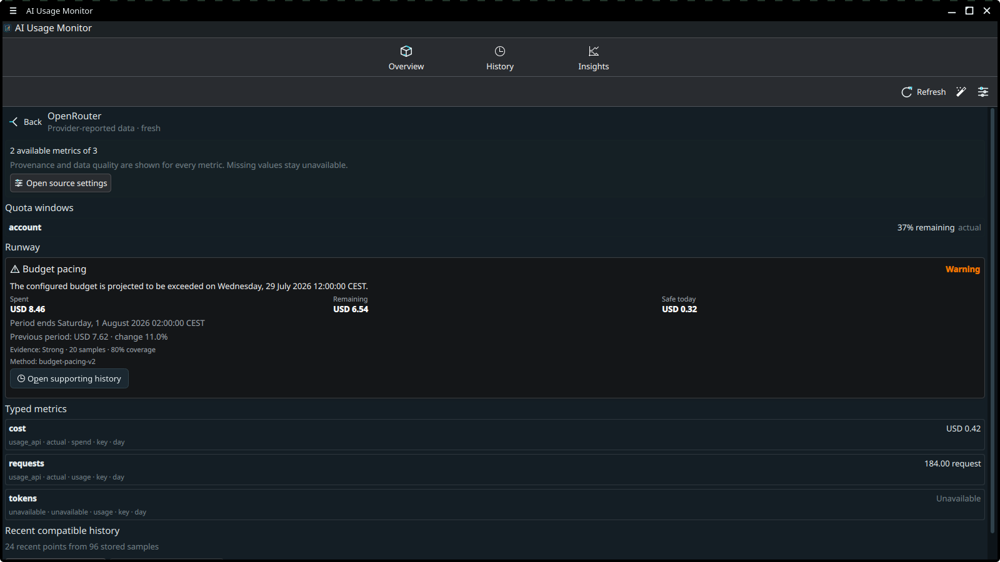
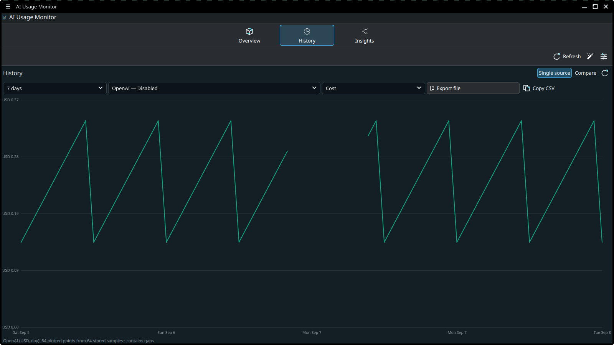
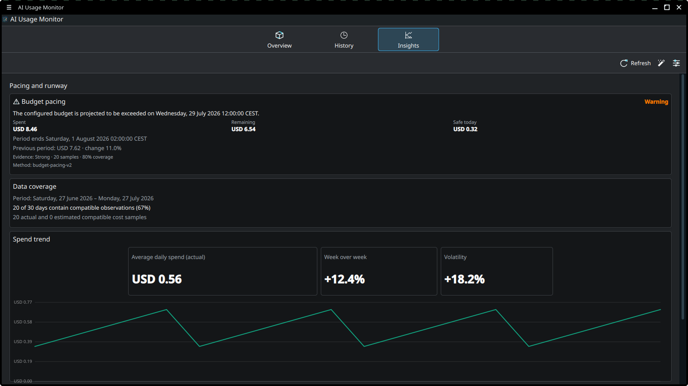
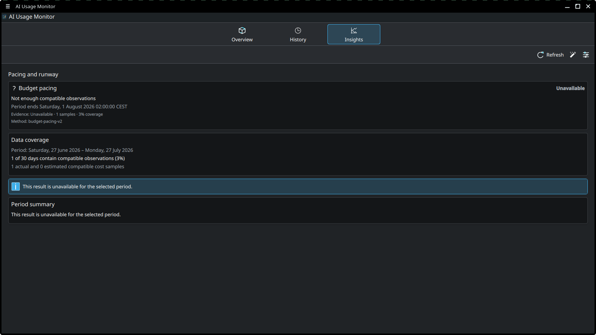
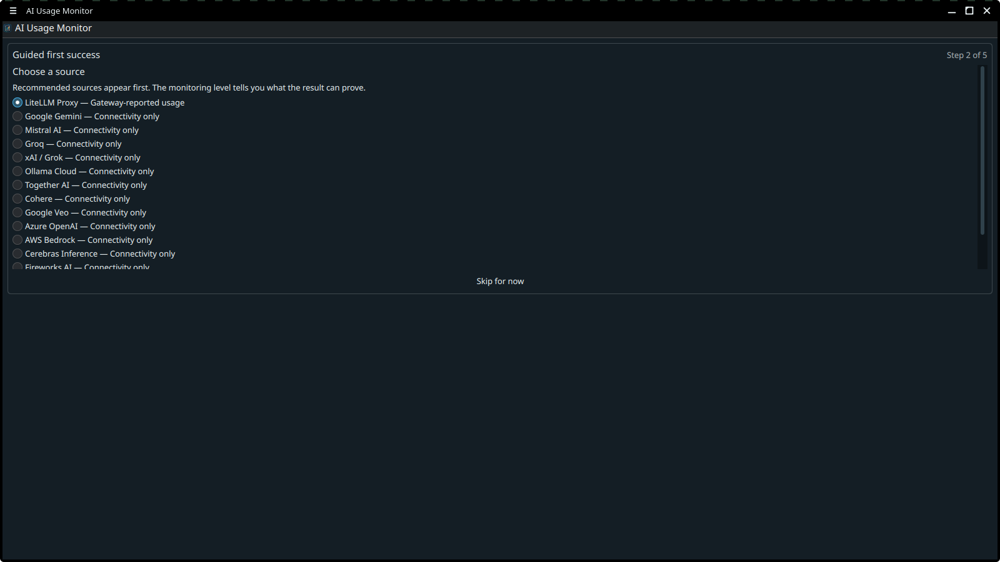
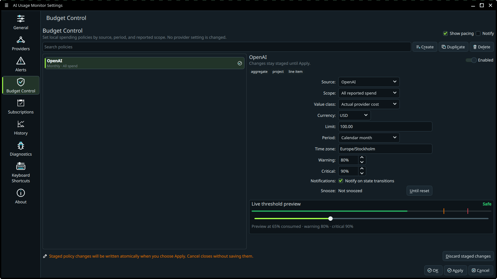
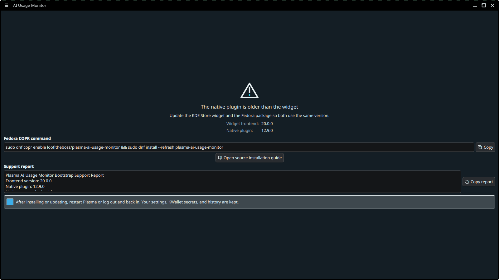

# AI Usage Monitor for KDE Plasma 6

  

AI Usage Monitor puts trustworthy daily AI usage, spend, quota, reset, and local coding-tool status in your Plasma panel. It stores API keys in KWallet and keeps history on your computer.

Version **20.0.0 (Reliable Daily Quotas)** separates verified quota from local
activity, keeps the next reset independent of the lowest quota, and displays
subscription price ranges without turning them into guessed fees. All daily
surfaces use the same normalized source state and presentation clock.

## Install on Fedora

The COPR package is the supported Fedora installation. It includes both the Plasma widget and the compiled Qt plugin.

~~~bash
sudo dnf copr enable loofitheboss/plasma-ai-usage-monitor
sudo dnf install plasma-ai-usage-monitor
~~~

Log out and back in after the first install. Then:

1. Right-click the panel or desktop and choose **Add Widgets**.
2. Search for **AI Usage Monitor**.
3. Add it to the panel or desktop.
4. Open the widget and complete **Guided first success** for one source.

To update later:

~~~bash
sudo dnf upgrade plasma-ai-usage-monitor
~~~

For source builds and other installation details, read the [installation guide](docs/user-guide/installation.md).

## Start here

- [Install or update the widget](docs/user-guide/installation.md)
- [Complete the first setup](docs/user-guide/getting-started.md)
- [Understand actual, estimated, and unavailable values](docs/user-guide/understanding-data.md)
- [Configure API providers](docs/user-guide/providers.md)
- [Track subscription tools and Browser Sync Labs](docs/user-guide/subscriptions.md)
- [Use Budget Control and deterministic runway guardrails](docs/user-guide/runway-guardrails.md)
- [Use history, exports, Prometheus, and webhooks](docs/user-guide/history-and-integrations.md)
- [Fix common problems](docs/user-guide/troubleshooting.md)
- [Review privacy and security behavior](docs/user-guide/privacy-and-security.md)

The [GitHub wiki](https://github.com/loofiboss-bit/plasma-ai-usage-monitor/wiki) provides the same task-based entry points for people who prefer GitHub's wiki navigation.

`docs/user-guide/` is the only editable source for end-user documentation. The
versioned `docs/wiki/` mirror is generated; update it with
`python3 scripts/generate_wiki_docs.py` and never edit it by hand.

## What it monitors

OpenAI can report account usage and spend with an Admin API key. OpenRouter can report key usage, LiteLLM can report gateway spend, and DeepSeek can report a balance. Many other providers expose only model discovery or account connectivity. AI Usage Monitor labels those results as connection checks and does not turn them into invented usage data. A tool-only setup is a complete daily monitor when the tool reports a live quota or a clearly labeled local estimate.

Hosted-provider support includes:

- OpenAI, Anthropic, Google Gemini, DeepSeek, OpenRouter, and Google Veo
- Mistral AI, Groq, xAI, Ollama Cloud, Together AI, and Cohere
- Azure OpenAI, AWS Bedrock, LiteLLM Proxy, Cerebras, Fireworks AI, and Perplexity

The generated [provider capability matrix](docs/provider-capabilities.md) lists the scheduled endpoint and monitoring level for every provider.

The widget also tracks Google Antigravity, Claude Code, Codex CLI, GitHub Copilot, Cursor, Windsurf, and JetBrains AI. Antigravity 2.x can report the signed-in plan, live per-model quota, and shared five-hour and weekly windows from its read-only localhost daemon; local activity and configured plan limits for other tools remain estimates unless a supported authenticated source provides a live quota window.

## Main features

- Guided first success for one provider or detected local tool
- Source-focused Settings with search, monitoring-level filters, and one detail pane
- Action-first Overview for attention, lowest live quota, next reset, spend categories, and source quality
- Provider usage, spend, balances, limits, and connection state where the provider exposes them
- Retained local history for enabled, disabled, and history-only sources, with explicit chart gaps
- Analyst snapshots with documented sample requirements, coverage, spend trends, activity, anomalies, and compatible drivers
- Typed Budget Control policies for day, ISO week, month, anchored month and reviewed provider reset periods
- Deterministic safe-today, remaining allowance, period projection and previous-period comparison
- Deterministic quota runway with explicit evidence and unavailable reasons
- Provider-reported model, project, workspace, service-tier, and line-item detail without aggregate double counting
- Compact panel modes for attention, lowest live quota, next reset, actual spend, and active sources
- Scoped OpenAI and Anthropic budget policies plus compatible aggregate LiteLLM/OpenRouter policies
- Persist-before-delivery warning, critical, exceeded, recovery and reset notifications with snooze
- Scheduled JSON or CSV exports
- An opt-in Prometheus endpoint that defaults to loopback; unauthenticated all-IPv4 listening requires explicit configuration
- Configuration schema-v3 backup for settings and policies; keys, tokens, cookies and webhook URLs remain excluded
- Native Diagnostics for the loaded plugin, install layers, database, source readiness, KWallet, catalogs, and browser profiles
- No telemetry or hosted backend

## Data boundaries

Scheduled provider refreshes do not run inference requests. Explicit inference tests are labeled in the widget and may consume provider quota or money.

Secrets stay in KWallet. Usage history stays in a local SQLite database. Browser Sync Labs and Antigravity monitoring are off by default and depend on version-sensitive local or service contracts. The Antigravity CSRF value stays in memory, is sent only to the validated loopback daemon, and is never included in logs, diagnostics, history, or exports.

Read [Understanding the data](docs/user-guide/understanding-data.md) before
creating policies or treating a provider card as a billing record. Explicit
configuration backups can contain local policy scope identities and should be
handled as sensitive files.

## Screenshots

| View | Screenshot |
| --- | --- |
| Narrow Overview |  |
| Attention |  |
| Source Detail |  |
| Real history gap |  |
| Analyst with sufficient data |  |
| Analyst with insufficient data |  |
| Guided setup |  |
| Budget Control |  |
| Plugin recovery |  |
| Panel lowest quota |  |

## Distribution notes

- **Fedora COPR:** supported and recommended. Includes the widget and compiled plugin.
- **Source build:** supported. Builds the same two parts.
- **KDE Store plasmoid:** frontend-only. Install the matching compiled plugin from COPR or a source build before installing the Store package. A missing or mismatched plugin opens an in-widget recovery screen; restart Plasma after repairing the installation.
- **Flatpak:** not supported because the native QML plugin is not packaged by the old scaffold.

## Development

The project uses C++20, Qt 6, KDE Frameworks 6, QML, CMake, and a repo-owned Justfile.

~~~bash
git clone https://github.com/loofiboss-bit/plasma-ai-usage-monitor.git
cd plasma-ai-usage-monitor
just doctor
just build-debug
just test
just check
~~~

Use `just dev` for QML-only changes. Use `just install`, `just reload`, and `just smoke` when the compiled plugin changes.

Contributor setup, architecture, code conventions, and release checks live in [CONTRIBUTING.md](CONTRIBUTING.md).

## Project documents

| Document | Purpose |
| --- | --- |
| [User guide](docs/user-guide/README.md) | Task-based help for installation, setup, daily use, and troubleshooting |
| [Provider capabilities](docs/provider-capabilities.md) | Generated provider monitoring contract |
| [Architecture](docs/architecture/reliability-core.md) | Runtime, schema, policy, secret, and distribution boundaries |
| [Configuration reference](docs/configuration-reference.md) | Config schema, policy fields, import/export and rollback compatibility |
| [Changelog](CHANGELOG.md) | Release history |
| [Roadmap](ROADMAP.md) | Current product direction and next work |
| [Security policy](SECURITY.md) | Vulnerability reporting and supported releases |
| [Contributing](CONTRIBUTING.md) | Developer workflow and contribution rules |

## Support

For a bug, open a [GitHub issue](https://github.com/loofiboss-bit/plasma-ai-usage-monitor/issues) and include:

- Plasma version from **plasmashell --version**
- Linux distribution and version
- installed widget version from **rpm -q plasma-ai-usage-monitor** on Fedora
- steps to reproduce
- the redacted support report from **Settings → Diagnostics**

Report security problems privately through [GitHub Security Advisories](https://github.com/loofiboss-bit/plasma-ai-usage-monitor/security/advisories/new).

## License

GPL-3.0-or-later. See [LICENSE](LICENSE).
